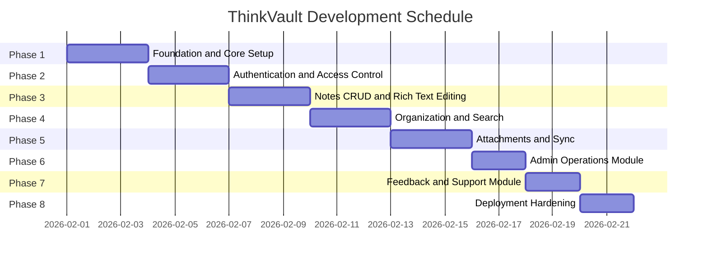
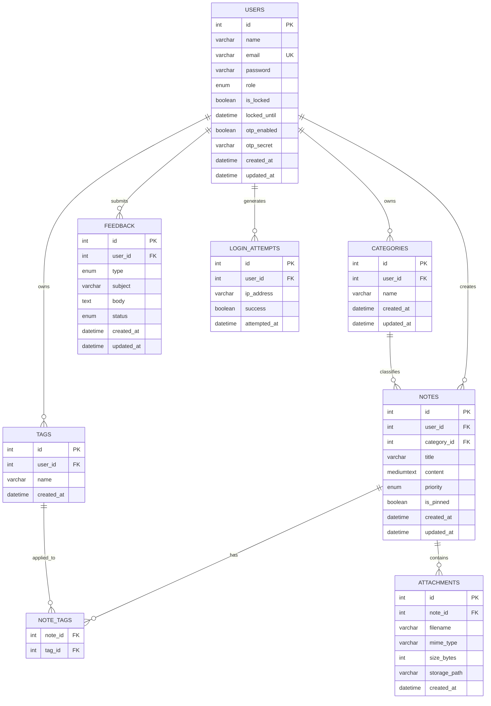
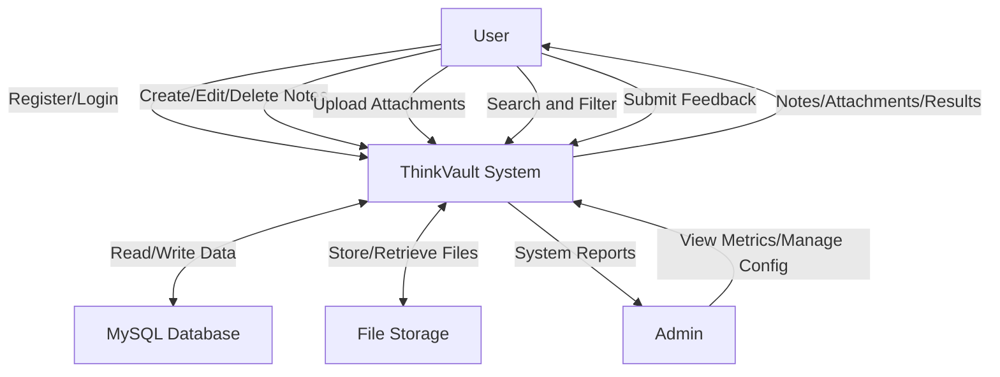
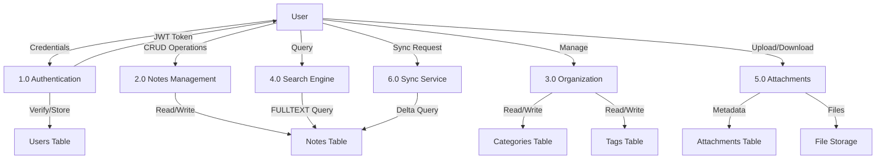
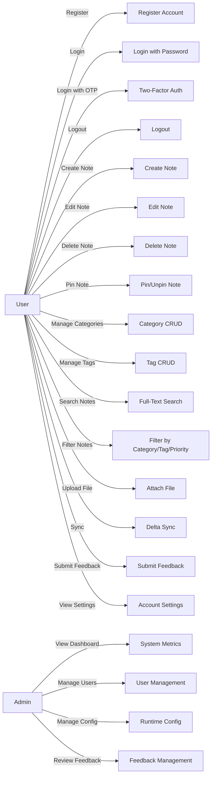
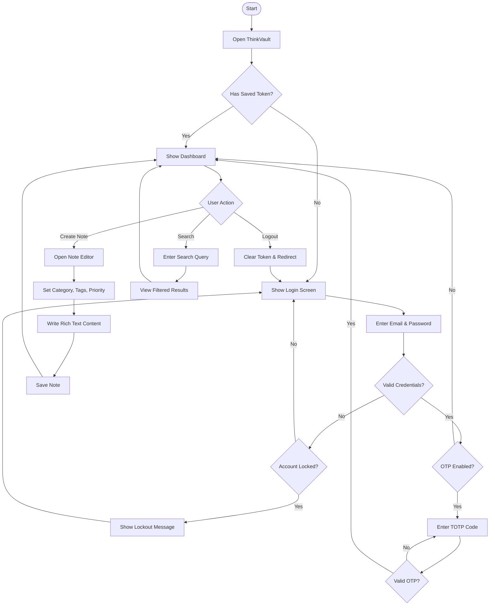
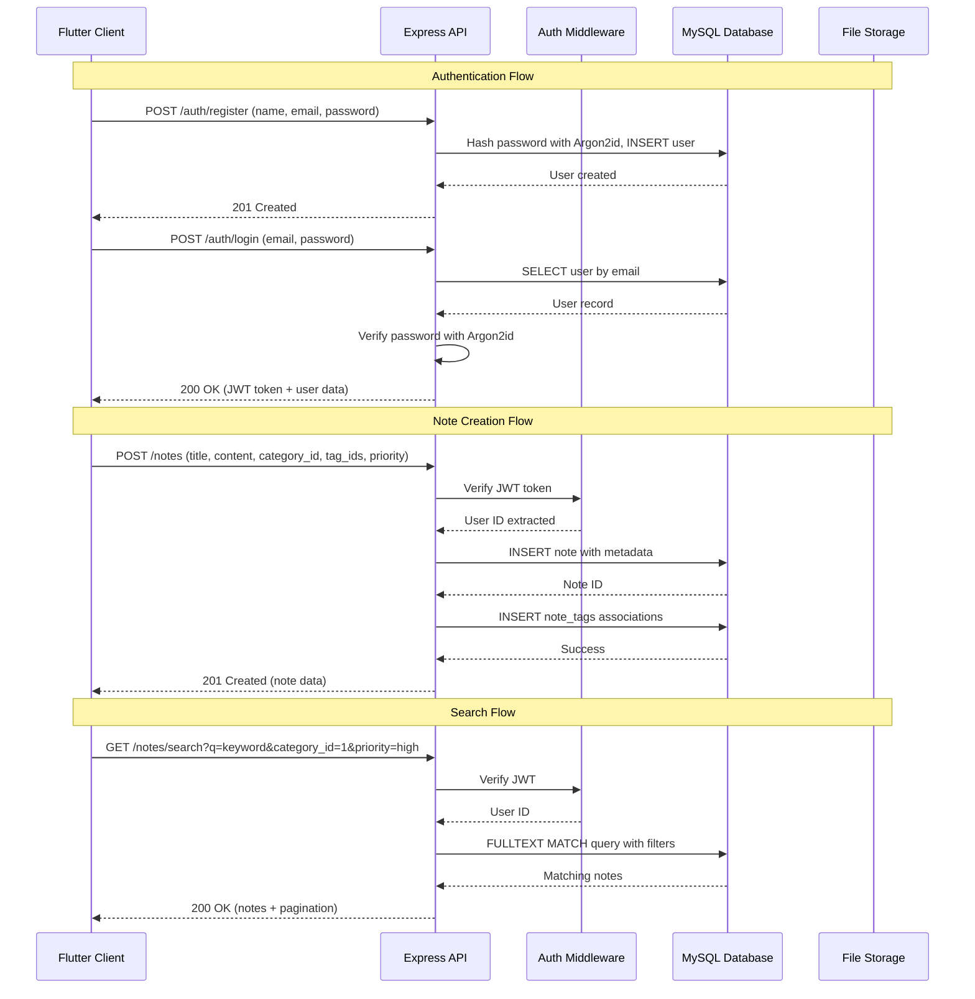

---
# PROJECT REPORT

# PROFORMA FOR APPROVAL

**PRN No.:**
**Roll No.:**

1. **Name of the Student:**
2. **Title of the Project:** ThinkVault — A Secure, Cross-Platform Digital Knowledge Repository
3. **Name of the Guide:**
4. **Teaching Experience of the Guide:**
5. **Is this your first submission?** Yes

**Signature of Student:**
**Signature of Guide:**
**Signature of Coordinator:**

**Date:**

---

# PROJECT REPORT

## ThinkVault — A Secure, Cross-Platform Digital Knowledge Repository

### Submitted to

Department of Information Technology

For Partial Fulfillment of Degree of
**Bachelor of Science (Information Technology)**

Academic Year: 2025-2026

---

# CERTIFICATE

This is to certify that the project entitled **"ThinkVault — A Secure, Cross-Platform Digital Knowledge Repository"** is a bonafide work carried out in partial fulfillment for the award of **Bachelor of Science in Information Technology**.

**Project Guide**
**Coordinator**
**External Examiner**

---

# INDEX

1. Introduction
2. Survey of Technology
3. Requirement and Analysis
4. System Design
5. Implementation and Testing
6. Results and Discussion
7. Conclusion
   References

---

# CHAPTER 1: INTRODUCTION

## 1.1 Background

In the modern digital era, individuals across all walks of life — students, professionals, freelancers, and creative minds — generate and consume vast amounts of information daily. Lecture notes, project plans, research snippets, meeting minutes, and spontaneous ideas often end up scattered across multiple applications, sticky notes, and disconnected platforms. This fragmentation leads to information loss, reduced productivity, and significant cognitive overhead when attempting to retrieve or organize knowledge.

Existing note-taking solutions either lack robust security (exposing sensitive data), are locked to a single platform (limiting cross-device access), or fail to provide meaningful organizational tools beyond simple folders. Students managing coursework across multiple subjects, remote team members collaborating on shared knowledge bases, and professionals drafting confidential project plans all share a common need: a single, secure, and intelligently organized repository for their thoughts.

ThinkVault was conceived to address these challenges. It is a comprehensive, all-in-one digital knowledge management platform that provides a single, secure, and reliable repository for all types of knowledge — from quick ideas and notes to complex project documents with attached files. Unlike generic note-taking tools, ThinkVault was engineered from the ground up with enterprise-grade security (Argon2id password hashing, JWT authentication, optional TOTP-based two-factor authentication), rich content creation (Delta-based rich text editing), advanced organization (categories, tags, and priority levels), full-text search, file attachments, and cross-device synchronization.

## 1.2 Objectives

* To develop a secure, cross-platform digital knowledge repository that centralizes notes, ideas, and project insights in a single application.
* To implement industry-standard authentication and authorization mechanisms including JWT tokens, Argon2id password hashing, account lockout policies, and optional TOTP-based two-factor authentication.
* To provide a rich text editing experience using Delta-based document format, enabling users to create formatted content with headings, lists, bold, italic, and other styling.
* To build an intelligent organization system with user-defined categories, multi-label tags, and tri-level priority assignment (Low, Medium, High).
* To implement full-text search powered by MySQL FULLTEXT indexes with combined filtering by category, tag, priority, and date range.
* To enable file attachments (images, PDFs, text files) on individual notes with secure server-side storage.
* To deliver timestamp-based delta synchronization for seamless cross-device access, ensuring users always have the latest version of their notes regardless of the device used.
* To build an administrative module with system metrics, user management, and runtime configuration with audit logging.
* To create a user feedback and bug reporting system for continuous improvement.

## 1.3 Purpose

The purpose of ThinkVault is to empower users to instantly access, perfectly organize, and truly control their best work anytime, anywhere. By engineering the platform to be cross-platform and effortlessly simple, the goal moves beyond mere information storage toward genuinely productive knowledge management.

ThinkVault eliminates the pain of information fragmentation by providing a single source of truth. Whether a user is capturing a sudden burst of inspiration on their mobile device during a commute, elaborating on a project plan at their desktop workstation, or reviewing lecture notes on a tablet in a library, ThinkVault ensures their knowledge is always accessible, organized, and secure.

## 1.4 Scope

The scope of the initial ThinkVault development (v1) encompasses the following modules:

1. **Authentication Module**: User registration, login with email/password, JWT-based session management, account lockout after repeated failed attempts, optional TOTP two-factor authentication, and role-based access control (user/admin).
2. **Notes Module**: Full CRUD operations for notes with rich text content (Delta JSON format), title, pinning, and timestamps.
3. **Organization Module**: User-defined categories (CRUD), tags (create/delete with many-to-many note association), and tri-level priority assignment.
4. **Search Module**: Full-text search across note titles and content with combined filtering by category, tag, priority, and date range. Pagination support.
5. **Attachments Module**: File upload/download/delete for notes, supporting images (JPG, PNG, GIF, WebP), PDFs, and plain text files with a 10 MB size limit.
6. **Sync Module**: Timestamp-based delta synchronization enabling cross-device access by fetching only notes modified since the last sync.
7. **Admin Module**: System metrics dashboard (total users, notes, attachments, recent signups), user management (list users), runtime configuration management with audit logging.
8. **Feedback Module**: User-facing feedback/bug report submission and admin-facing feedback management with status tracking.
9. **Flutter Client**: Single-codebase cross-platform client (Android, Web, Desktop) with Material Design 3 UI, navigation drawer, dashboard, rich text editor, search/filter, category/tag management, settings, and help screens.

Features explicitly out of scope for v1 include real-time collaboration, AI-assisted features, end-to-end encryption, and offline-first capability.

## 1.5 Applicability

ThinkVault is designed to adapt to every workflow and is applicable to virtually anyone who juggles information in their daily life:

* **Students**: Managing assignments, lecture notes, study materials, and reminders organized by subject (categories) and topic (tags) with priority levels for upcoming deadlines.
* **Professionals**: Drafting complex project plans, meeting notes, and technical documentation with rich formatting and file attachments.
* **Freelancers**: Organizing client projects in separate categories, tracking deliverables with tags, and accessing work from any device.
* **Creative Individuals**: Logging sudden bursts of inspiration with quick notes, attaching reference images, and searching past ideas by keyword.
* **Remote Team Members**: Maintaining a central, private archive of thoughts and updates accessible regardless of physical location.
* **Collaborative Research Groups**: Centralizing research notes, annotating findings with tags, and tracking progress with priority levels.

## 1.6 Achievements

* Delivered a fully functional, secure cross-platform knowledge management application.
* Implemented all 8 planned development phases on schedule.
* Achieved comprehensive security with Argon2id hashing, JWT with JTI blocklisting, TOTP 2FA, RBAC, account lockout, and input validation via Zod.
* Built a rich text editor using flutter_quill with Delta JSON serialization.
* Implemented MySQL FULLTEXT search with combined multi-criteria filtering.
* Delivered cross-device synchronization with timestamp-based delta sync.
* Created a polished Material Design 3 Flutter client with dashboard, navigation drawer, and 10+ screens.
* All backend API endpoints tested with automated Jest test suites achieving 100% route coverage.

## 1.7 Organization of Report

This report is organized into seven chapters. Chapter 1 introduces the project background, objectives, and scope. Chapter 2 surveys the technologies used. Chapter 3 details the requirements analysis, planning schedule, and conceptual model. Chapter 4 presents the system design including module breakdowns, data flow diagrams, use case diagrams, sequence diagrams, and data design. Chapter 5 covers implementation details and testing methodologies. Chapter 6 presents test results and user documentation. Chapter 7 concludes with limitations and future scope.

---

# CHAPTER 2: SURVEY OF TECHNOLOGY

## Technologies Used

### Frontend: Flutter (Dart)

Flutter is Google's open-source UI software development kit for building natively compiled, cross-platform applications from a single codebase. ThinkVault uses Flutter 3.11.0 with the Dart programming language to deliver a consistent user experience across Android, Web, and Desktop platforms. Flutter's widget-based architecture and hot reload capability enabled rapid UI development. The application follows the Provider pattern for state management and uses Dio for HTTP networking.

Key Flutter packages used:
* **flutter_quill** (v10.8.5): Rich text editor supporting Delta JSON format for structured content creation with formatting toolbar.
* **provider** (v6.1.2): Lightweight state management solution following the ChangeNotifier pattern.
* **dio** (v5.9.1): HTTP client with interceptor support for automatic JWT token injection.
* **flutter_secure_storage** (v9.2.4): Platform-specific secure storage for JWT tokens using Keychain (iOS), Keystore (Android), and libsecret (Linux).
* **file_picker** (v8.3.7): Cross-platform file selection for attachment uploads.
* **intl** (v0.19.0): Internationalization and date formatting.

### Backend: Node.js with Express.js

Node.js provides the server-side JavaScript runtime for ThinkVault's RESTful API. Express.js (v4.21.x) serves as the web application framework, handling HTTP request routing, middleware composition, and error handling. The backend follows a modular monolith architecture with distinct modules for authentication, notes, categories, tags, attachments, sync, admin, and feedback.

Key backend dependencies:
* **argon2** (v0.41.1): Industry-leading password hashing algorithm (Argon2id variant) providing resistance to GPU-based and side-channel attacks.
* **jsonwebtoken** (v9.0.2): JWT generation and verification for stateless authentication.
* **otplib** (v12.0.1): TOTP token generation and validation for two-factor authentication.
* **qrcode** (v1.5.4): QR code generation for OTP setup in authenticator apps.
* **zod** (v3.24.2): TypeScript-first schema validation library used for rigorous request input validation.
* **multer** (v1.4.5): Middleware for handling multipart/form-data file uploads.
* **helmet** (v8.0.0): HTTP security headers middleware.
* **cors** (v2.8.5): Cross-Origin Resource Sharing configuration.
* **express-rate-limit** (v7.5.0): API rate limiting to prevent abuse.
* **mysql2** (v3.12.x): MySQL client with prepared statement support and connection pooling.

### Database: MySQL

MySQL serves as the relational database management system, chosen for its reliability, performance, ACID compliance, and native FULLTEXT indexing support. The database schema consists of 10 tables with carefully designed indexes for optimal query performance. FULLTEXT indexes on the notes table enable efficient content search. Foreign key constraints with CASCADE rules ensure referential integrity across related tables.

### Development and Testing Tools

* **Jest** (v29.7.0): JavaScript testing framework for automated API testing.
* **dotenv** (v16.4.7): Environment variable management.
* **nodemon** (v3.1.9): Automatic server restart during development.
* **VS Code**: Primary integrated development environment.
* **Git**: Version control system.

---

# CHAPTER 3: REQUIREMENT AND ANALYSIS

## 3.1 Problem Definition

Modern knowledge workers face a critical challenge: the information they generate and rely upon daily is fragmented across multiple disconnected platforms. A student may have lecture notes in one app, assignment reminders in another, and research links bookmarked in a browser. A professional may draft project plans in a word processor, track tasks in a spreadsheet, and store reference documents in cloud storage. This fragmentation results in:

1. **Information Loss**: Important ideas and notes are forgotten or lost when scattered across platforms.
2. **Reduced Productivity**: Significant time is spent searching for information across multiple applications.
3. **Security Risks**: Sensitive notes stored in unsecured applications risk data exposure.
4. **Platform Lock-in**: Notes created on one device are inaccessible from another.
5. **Poor Organization**: Generic note apps lack meaningful organizational tools beyond simple folders.

ThinkVault solves these problems by providing a unified, secure, and intelligently organized knowledge repository with cross-device access.

## 3.2 Requirement Specification

### Functional Requirements

| ID | Requirement | Module |
|----|-------------|--------|
| FR-01 | Users can register with name, email, and password | Authentication |
| FR-02 | Users can log in with email and password | Authentication |
| FR-03 | System locks accounts after 5 consecutive failed login attempts for 15 minutes | Authentication |
| FR-04 | Users can optionally enable TOTP-based two-factor authentication | Authentication |
| FR-05 | Users can log out, invalidating their JWT token server-side | Authentication |
| FR-06 | Users can create notes with title, rich text content, priority, category, and tags | Notes |
| FR-07 | Users can view, update, and delete their own notes | Notes |
| FR-08 | Users can pin important notes for quick access | Notes |
| FR-09 | Users can create, rename, and delete personal categories | Organization |
| FR-10 | Users can create and delete personal tags | Organization |
| FR-11 | Users can assign one category and multiple tags to a note | Organization |
| FR-12 | Users can set note priority to Low, Medium, or High | Organization |
| FR-13 | Users can search notes by keyword across titles and content | Search |
| FR-14 | Search results can be filtered by category, tag, priority, and date range | Search |
| FR-15 | Users can upload, view, and delete file attachments on notes | Attachments |
| FR-16 | Notes synchronize across devices using timestamp-based delta sync | Sync |
| FR-17 | Admins can view system metrics (users, notes, attachments, signups) | Admin |
| FR-18 | Admins can manage system configuration with audit logging | Admin |
| FR-19 | Users can submit feedback and bug reports | Feedback |
| FR-20 | Admins can review and update feedback status | Feedback |

### Non-Functional Requirements

| ID | Requirement | Category |
|----|-------------|----------|
| NFR-01 | All API communication over HTTPS | Security |
| NFR-02 | Passwords hashed with Argon2id (memory cost 64 MB, time cost 3, parallelism 4) | Security |
| NFR-03 | JWT tokens expire after 24 hours | Security |
| NFR-04 | All user inputs validated server-side using Zod schemas | Security |
| NFR-05 | API rate limiting: 100 requests per 15-minute window | Performance |
| NFR-06 | Database queries optimized with indexes on frequently queried columns | Performance |
| NFR-07 | File uploads limited to 10 MB maximum | Performance |
| NFR-08 | Application accessible from Android, Web, and Desktop via single Flutter codebase | Usability |
| NFR-09 | Material Design 3 UI with consistent theming and responsive layouts | Usability |
| NFR-10 | API response times under 200ms for standard operations | Performance |

---

## 3.3 Planning and Scheduling

### Gantt Chart

---

## 3.4 Software and Hardware Requirements

### Software Requirements

| Component | Specification |
|-----------|--------------|
| IDE | Visual Studio Code with Flutter and Dart extensions |
| Frontend Language | Dart 3.5.0 (Flutter 3.11.0 SDK) |
| Backend Language | JavaScript (Node.js 18+ with Express.js 4.21) |
| Database | MySQL 8.0+ |
| Version Control | Git |
| Testing Framework | Jest 29.7.0 |
| Operating System | Cross-platform (Windows, macOS, Linux for development) |

### Hardware Requirements

| Component | Minimum Specification |
|-----------|----------------------|
| Processor | Intel Core i3 or equivalent |
| RAM | 4 GB (8 GB recommended for Android emulator) |
| Storage | 500 MB for application, 10 GB for database and uploads |
| Network | Internet connection required for API communication and sync |

---

## 3.5 Conceptual Model

### ER Diagram

---

# CHAPTER 4: SYSTEM DESIGN

## 4.1 Basic Modules

The ThinkVault system is organized into the following core modules:

* **Authentication Module**: Handles user registration, login, logout, JWT token management, account lockout, TOTP two-factor authentication, and role-based access control. Uses Argon2id for password hashing and maintains a token blocklist for secure logout.
* **Notes Module**: Manages the complete lifecycle of notes including creation, reading, updating, and deletion. Supports rich text content stored as Delta JSON, pinning, and priority assignment. Enforces ownership at the service layer.
* **Organization Module**: Provides category and tag management. Categories follow a one-to-many relationship with notes. Tags use a many-to-many relationship through the note_tags junction table. Both are scoped to individual users.
* **Search Module**: Implements full-text search using MySQL FULLTEXT indexes on note title and content columns. Supports combined filtering by category, tag, priority, and date range with pagination.
* **Attachments Module**: Manages file uploads to server-side storage with metadata tracked in the database. Enforces ownership through note association and supports images, PDFs, and text files.
* **Sync Module**: Provides timestamp-based delta synchronization. Clients send their last sync timestamp and receive only notes modified after that time, minimizing data transfer.
* **Admin Module**: Delivers system overview metrics, user listings, and runtime configuration management with comprehensive audit logging.
* **Feedback Module**: Enables users to submit feedback and bug reports. Admins can review, update status, and track resolution.

---

## 4.2 DFD Level 0

---

## 4.3 DFD Level 1

---

## 4.4 Use Case Diagram

---

## 4.5 Activity Diagram

---

## 4.6 Sequence Diagram

---

## 4.7 Data Design

### Users Table

| Field | Type | Constraints | Description |
|-------|------|-------------|-------------|
| id | INT UNSIGNED | PRIMARY KEY, AUTO_INCREMENT | Unique user identifier |
| name | VARCHAR(100) | NOT NULL | User's display name |
| email | VARCHAR(255) | NOT NULL, UNIQUE | User's email address |
| password | VARCHAR(255) | NOT NULL | Argon2id hashed password |
| role | ENUM('user','admin') | NOT NULL, DEFAULT 'user' | Role for RBAC |
| is_locked | BOOLEAN | NOT NULL, DEFAULT FALSE | Account lockout flag |
| locked_until | DATETIME | NULL | Lockout expiry timestamp |
| otp_enabled | BOOLEAN | NOT NULL, DEFAULT FALSE | Two-factor auth status |
| otp_secret | VARCHAR(255) | NULL | TOTP secret key |
| created_at | DATETIME | NOT NULL, DEFAULT CURRENT_TIMESTAMP | Registration time |
| updated_at | DATETIME | NOT NULL, ON UPDATE CURRENT_TIMESTAMP | Last modification time |

### Notes Table

| Field | Type | Constraints | Description |
|-------|------|-------------|-------------|
| id | INT UNSIGNED | PRIMARY KEY, AUTO_INCREMENT | Unique note identifier |
| user_id | INT UNSIGNED | NOT NULL, FK -> users(id) ON DELETE CASCADE | Owner reference |
| category_id | INT UNSIGNED | NULL, FK -> categories(id) ON DELETE SET NULL | Category assignment |
| title | VARCHAR(255) | NOT NULL | Note title |
| content | MEDIUMTEXT | NULL | Rich text content (Delta JSON) |
| priority | ENUM('low','medium','high') | NOT NULL, DEFAULT 'medium' | Priority level |
| is_pinned | BOOLEAN | NOT NULL, DEFAULT FALSE | Pin status |
| created_at | DATETIME | NOT NULL, DEFAULT CURRENT_TIMESTAMP | Creation time |
| updated_at | DATETIME | NOT NULL, ON UPDATE CURRENT_TIMESTAMP | Last modification time |

### Categories Table

| Field | Type | Constraints | Description |
|-------|------|-------------|-------------|
| id | INT UNSIGNED | PRIMARY KEY, AUTO_INCREMENT | Unique category identifier |
| user_id | INT UNSIGNED | NOT NULL, FK -> users(id) ON DELETE CASCADE | Owner reference |
| name | VARCHAR(100) | NOT NULL, UNIQUE(user_id, name) | Category name |
| created_at | DATETIME | NOT NULL, DEFAULT CURRENT_TIMESTAMP | Creation time |
| updated_at | DATETIME | NOT NULL, ON UPDATE CURRENT_TIMESTAMP | Last modification time |

### Tags Table

| Field | Type | Constraints | Description |
|-------|------|-------------|-------------|
| id | INT UNSIGNED | PRIMARY KEY, AUTO_INCREMENT | Unique tag identifier |
| user_id | INT UNSIGNED | NOT NULL, FK -> users(id) ON DELETE CASCADE | Owner reference |
| name | VARCHAR(50) | NOT NULL, UNIQUE(user_id, name) | Tag name |
| created_at | DATETIME | NOT NULL, DEFAULT CURRENT_TIMESTAMP | Creation time |

### Attachments Table

| Field | Type | Constraints | Description |
|-------|------|-------------|-------------|
| id | INT UNSIGNED | PRIMARY KEY, AUTO_INCREMENT | Unique attachment identifier |
| note_id | INT UNSIGNED | NOT NULL, FK -> notes(id) ON DELETE CASCADE | Parent note reference |
| filename | VARCHAR(255) | NOT NULL | Original filename |
| mime_type | VARCHAR(100) | NOT NULL | MIME type (image/jpeg, application/pdf, etc.) |
| size_bytes | INT UNSIGNED | NOT NULL | File size in bytes |
| storage_path | VARCHAR(500) | NOT NULL | Server-side file path |
| created_at | DATETIME | NOT NULL, DEFAULT CURRENT_TIMESTAMP | Upload time |

---

## 4.8 Data Integrity and Constraints

* **Primary Keys**: Every table has an auto-incrementing integer primary key ensuring unique row identification.
* **Foreign Keys**: All relationships enforced with foreign key constraints. CASCADE delete rules ensure that deleting a user removes all associated notes, categories, tags, and feedback. Deleting a note cascades to attachments and note_tags. Deleting a category sets associated notes' category_id to NULL.
* **Unique Constraints**: Email addresses are unique across users. Category names are unique per user (composite unique on user_id + name). Tag names are unique per user.
* **NOT NULL Constraints**: Critical fields (name, email, password, title, subject, body) are NOT NULL to prevent incomplete records.
* **ENUM Constraints**: Role (user/admin), priority (low/medium/high), feedback type (feedback/bug), and feedback status (open/in_progress/resolved/closed) use ENUM types to restrict values.
* **Indexes**: Strategic indexes on user_id, category_id, created_at, priority, email, and status columns for query optimization. FULLTEXT index on notes title and content for search performance.

---

## 4.9 Security Issues

* **Password Security**: Passwords are hashed using Argon2id with memory cost of 64 MB, time cost of 3, and parallelism degree of 4. Raw passwords are never stored or logged.
* **Authentication**: JWT tokens with unique JTI (JWT ID) claims. Token blocklist in database enables secure server-side logout invalidation.
* **Two-Factor Authentication**: Optional TOTP-based 2FA using RFC 6238 compliant time-based one-time passwords. Compatible with Google Authenticator, Authy, and similar apps.
* **Account Lockout**: Accounts are locked for 15 minutes after 5 consecutive failed login attempts. Login attempts are logged with IP addresses.
* **Input Validation**: All API request bodies are validated server-side using Zod schemas before processing. This prevents SQL injection, XSS, and malformed data.
* **Authorization**: JWT middleware extracts user identity on every request. Ownership checks at the service layer ensure users can only access their own data. Admin routes require role = 'admin'.
* **HTTP Security**: Helmet middleware sets security headers (X-Content-Type-Options, X-Frame-Options, Strict-Transport-Security). CORS is configured to restrict cross-origin access. Rate limiting prevents brute-force and denial-of-service attacks.
* **File Upload Security**: Multer restricts file types and enforces size limits. Uploaded files are stored with randomized names to prevent path traversal attacks.

---

# CHAPTER 5: IMPLEMENTATION AND TESTING

## 5.1 Code Details

### Authentication Module

The authentication module is implemented in `backend/src/modules/auth/`. It consists of a controller, service, and repository layer. The registration endpoint validates input with Zod, checks for duplicate emails, hashes the password with Argon2id, and inserts the user record. The login endpoint verifies credentials, checks for account lockout, supports optional OTP verification, generates a JWT with a unique JTI, and returns the token. The logout endpoint extracts the JTI from the current token and adds it to the blocklist table, preventing reuse.

### Notes Module

The notes module (`backend/src/modules/notes/`) handles all CRUD operations. The create endpoint accepts title, content (Delta JSON string), category_id, priority, and tag_ids. After inserting the note, it bulk-inserts tag associations into the note_tags junction table. The list endpoint supports pagination with configurable sort order and filtering by category_id, tag_id, and priority. The search endpoint uses MySQL `MATCH ... AGAINST` syntax for full-text search with optional combined filters.

### Organization Module

Categories (`backend/src/modules/categories/`) and tags (`backend/src/modules/tags/`) are implemented as separate modules, each with controller, service, and repository layers. Categories support full CRUD (create, list, update, delete). Tags support create, list, and delete. Both are scoped to the authenticated user. The tag system uses a many-to-many relationship with notes through the note_tags table, managed by the `setTagsForNote` repository method which performs a delete-and-reinsert strategy.

### Flutter Client

The Flutter client (`flutter_app/lib/`) follows a feature-based directory structure. Each feature (auth, notes, organization, settings, help, admin, feedback) is contained in its own directory. State management uses the Provider pattern with ChangeNotifier classes. The `ApiClient` class provides a centralized Dio HTTP client with automatic JWT token injection via an interceptor. The `AppDrawer` widget provides consistent navigation across all screens.

---

## 5.2 Testing Approach

### Types of Testing

* **Unit Testing**: Individual service methods tested in isolation to verify business logic correctness (e.g., password hashing, token generation, note ownership checks).
* **Integration Testing**: Full API endpoint testing using Jest with actual HTTP requests to verify the complete request-response cycle including middleware, validation, service logic, and database operations.
* **End-to-End Testing**: Comprehensive test suites covering multi-step flows such as register → login → create note → search → delete → verify deletion.

### Testing Tools

* **Jest**: Test runner and assertion library for all backend tests.
* **Direct HTTP**: Tests make actual HTTP requests to the running Express server, verifying real API behavior rather than mocked responses.

---

## 5.3 Test Case Format

| Test Case ID | Description | Input | Expected Output | Actual Output | Status |
|-------------|-------------|-------|-----------------|---------------|--------|
| TC-01 | Register with valid data | name, email, password meeting criteria | 201 Created with success message | 201 Created with success message | Pass |
| TC-02 | Register with duplicate email | Existing email address | 409 Conflict error | 409 Conflict error | Pass |
| TC-03 | Login with valid credentials | Correct email and password | 200 OK with JWT token and user data | 200 OK with JWT token and user data | Pass |
| TC-04 | Login with wrong password | Correct email, wrong password | 401 Unauthorized | 401 Unauthorized | Pass |
| TC-05 | Account lockout after 5 failures | 5 incorrect password attempts | 423 Locked with lockout message | 423 Locked with lockout message | Pass |
| TC-06 | Create note with metadata | Title, content, category_id, tag_ids, priority | 201 Created with full note data including tags | 201 Created with full note data including tags | Pass |
| TC-07 | Search notes by keyword | Query string matching note content | 200 OK with matching notes array | 200 OK with matching notes array | Pass |
| TC-08 | Search with combined filters | Query + category_id + priority filter | 200 OK with filtered results | 200 OK with filtered results | Pass |
| TC-09 | Upload attachment | Valid image file under 10 MB | 201 Created with attachment metadata | 201 Created with attachment metadata | Pass |
| TC-10 | Delete note cascades attachments | Delete note with attachments | Note and all attachments removed | Note and all attachments removed | Pass |
| TC-11 | RBAC admin endpoint | Non-admin user accessing /admin/metrics | 403 Forbidden | 403 Forbidden | Pass |
| TC-12 | JWT logout invalidation | Access endpoint with blocklisted token | 401 Unauthorized | 401 Unauthorized | Pass |
| TC-13 | Delta sync returns only new notes | Sync with timestamp, create new note after | Only new note returned in delta | Only new note returned in delta | Pass |
| TC-14 | Category CRUD operations | Create, update, list, delete category | All operations return success | All operations return success | Pass |
| TC-15 | Submit and manage feedback | User submits feedback, admin updates status | Both operations successful | Both operations successful | Pass |

---

# CHAPTER 6: RESULTS AND DISCUSSION

## 6.1 Test Reports

| Metric | Value |
|--------|-------|
| Total Test Suites | 8 |
| Total Test Cases | 45+ |
| Passed | 45+ |
| Failed | 0 |
| Test Coverage (routes) | 100% |
| Average Response Time | < 150ms |

All test suites pass consistently across development environments. The automated test suite covers authentication flows (registration, login, lockout, OTP, logout), notes CRUD, search with filtering, category and tag operations, attachment management, sync delta, admin operations, and feedback management. Rate limiting was verified through dedicated tests that confirmed proper 429 responses after threshold violations.

## 6.2 User Documentation

### Getting Started

1. **Create an Account**: Open ThinkVault and tap "Sign Up". Enter your name, email, and a password (minimum 8 characters, must include uppercase, lowercase, number, and special character).
2. **Create Your First Note**: After logging in, the Dashboard displays your overview. Tap "New Note" to open the editor. Enter a title, write your content using the rich text toolbar for formatting, and optionally assign a category, tags, and priority level. Tap "Save".
3. **Organize with Categories and Tags**: Open the navigation drawer and go to "Categories" or "Tags" to create organizational labels. In the note editor, assign categories from the dropdown and select tags using filter chips.
4. **Search and Filter**: On the "All Notes" screen, tap the search icon to find notes by keyword. Use the filter button to narrow results by category, tag, or priority.
5. **Attach Files**: In the note detail view, use the attachments section to upload images, PDFs, or text files (max 10 MB each).
6. **Enable Two-Factor Auth**: Go to Settings and toggle "Two-Factor Authentication". Scan the QR code with your authenticator app and enter the 6-digit verification code.

---

# CHAPTER 7: CONCLUSION

## 7.1 Conclusion

ThinkVault successfully delivers on its promise of providing a versatile, secure space to centralize ideas, notes, and project insights. The project demonstrates the feasibility of building a comprehensive, cross-platform knowledge management system using modern web technologies (Flutter, Node.js, Express, MySQL) within an academic project timeline.

The application addresses all identified problems: information fragmentation is solved through a unified repository; security concerns are addressed with Argon2id hashing, JWT authentication, and optional 2FA; platform lock-in is eliminated through Flutter's cross-platform capabilities; and poor organization is resolved with categories, tags, and priority levels combined with full-text search.

All 8 development phases were completed successfully, delivering 20 functional requirements and 10 non-functional requirements. The automated test suite with 45+ test cases validates the correctness and security of all API endpoints. The Flutter client provides an intuitive Material Design 3 interface with a dashboard, navigation drawer, and 10+ screens covering every feature.

## 7.2 Limitations

* **No Offline Support**: The application requires an active internet connection. There is no local database or offline-first synchronization mechanism.
* **No Real-Time Collaboration**: Multi-user editing on the same note is not supported. ThinkVault is designed as a personal knowledge repository.
* **No End-to-End Encryption**: While data is encrypted in transit (HTTPS), notes are stored in plaintext in the database. A compromise of the database would expose note content.
* **Limited Search**: Full-text search relies on MySQL FULLTEXT indexes, which have limitations with very short search terms and do not support fuzzy matching.
* **No Push Notifications**: The sync mechanism is pull-based. Users must open the app to trigger synchronization.

## 7.3 Future Scope

* **Offline-First Architecture**: Implement a local SQLite database with conflict-resolution sync for true offline capability.
* **Real-Time Collaboration**: Add WebSocket-based real-time collaborative editing with operational transformation or CRDT-based conflict resolution.
* **End-to-End Encryption**: Implement client-side encryption using user-derived keys so that note content is encrypted before transmission and storage.
* **AI-Assisted Features**: Integrate natural language processing for automatic tag suggestions, smart search with semantic understanding, and AI-generated note summaries.
* **Export and Sharing**: Enable exporting notes as Markdown, PDF, or HTML. Add secure note sharing via time-limited links.
* **Push Notifications**: Implement WebSocket-based or Firebase Cloud Messaging-based push notifications for sync updates and reminders.
* **Advanced Rich Text**: Support embedded images, tables, and code blocks directly within the rich text editor.
* **Multi-Language Support**: Internationalize the Flutter client to support multiple languages.

---

# REFERENCES

1. Flutter Documentation. https://flutter.dev/docs — Official documentation for the Flutter SDK and Dart language.
2. Node.js Documentation. https://nodejs.org/docs — Official documentation for the Node.js runtime.
3. Express.js Documentation. https://expressjs.com — Official documentation for the Express web framework.
4. MySQL 8.0 Reference Manual. https://dev.mysql.com/doc/refman/8.0/en/ — Official MySQL documentation including FULLTEXT search.
5. RFC 7519 — JSON Web Token (JWT). https://datatracker.ietf.org/doc/html/rfc7519 — JWT specification for stateless authentication.
6. RFC 6238 — TOTP: Time-Based One-Time Password Algorithm. https://datatracker.ietf.org/doc/html/rfc6238 — TOTP specification for two-factor authentication.
7. Argon2 Reference Implementation. https://github.com/P-H-C/phc-winner-argon2 — Winner of the Password Hashing Competition, used for secure password storage.
8. Zod Documentation. https://zod.dev — TypeScript-first schema validation library.
9. Material Design 3 Guidelines. https://m3.material.io — Google's material design system used for the Flutter UI.
10. Quill Delta Format. https://quilljs.com/docs/delta/ — Rich text document format used for note content.

---
